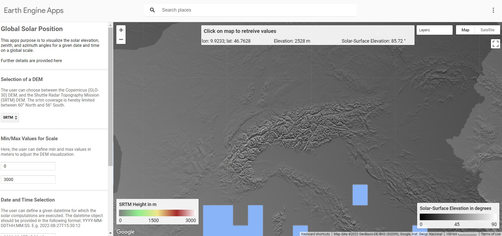

# GlobalSolarPosition
Global computation of the solar position at a given time in Google Earth Engine

The calculations of the solar zenith and azimuth angles are based on the [following equations](https://gml.noaa.gov/grad/solcalc/solareqns.PDF).

## Available Functions

The following functions are currently available:

* `Solar_Position_Function` Script for computing the the solar elevation, zenith, and azimuth angles for a given date and time on a global scale.
* `Solar_Surface_Position_Function` Script for computing the the solar-surface elevation, zenith, and azimuth angles for a given date and time on a global scale. The angles hereby represent the solar elevation, zenith, and azimuth relative the surface's slope and aspect based on the selected digital elevation model (DEM).

## Google Earth Engine Application

An interactive Google Earth Engine application for visualizing the solar elevation, zenith, and azimuth angles for a given date and time on a global scale can be [accessed here](https://mbalthasarphilipp.users.earthengine.app/view/globalsolarposition).

